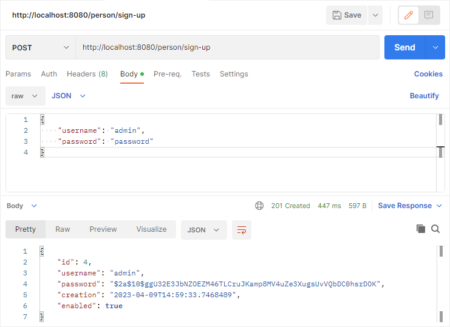

# Реализация REST API на Spring Boot.

## Общее описание:

Простой REST service для модели Person.

***

## Реализовано:
* Авторизация/аутентификация JWT
* DTO
* Валидация моделей

***

## Пример POST запроса в формате JSON

